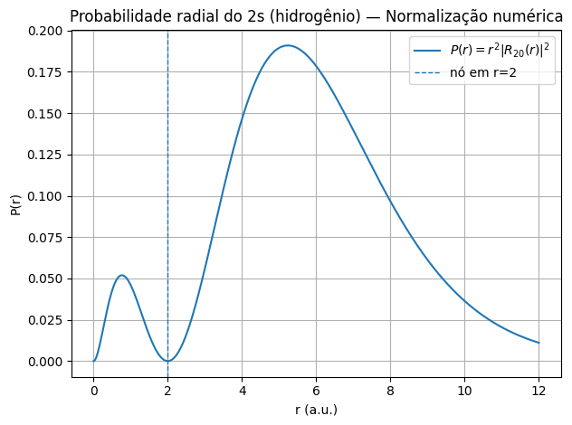
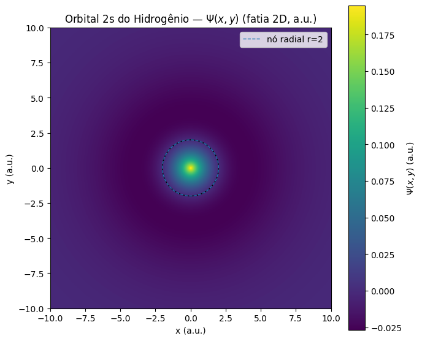
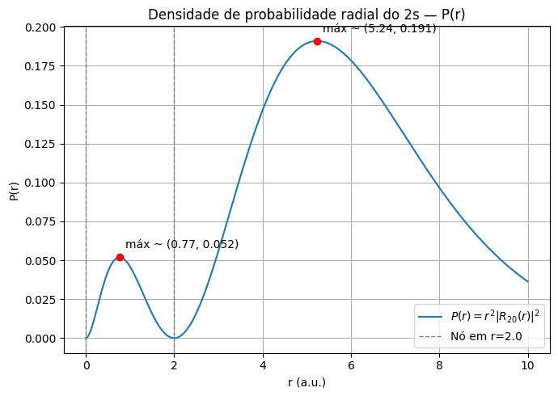
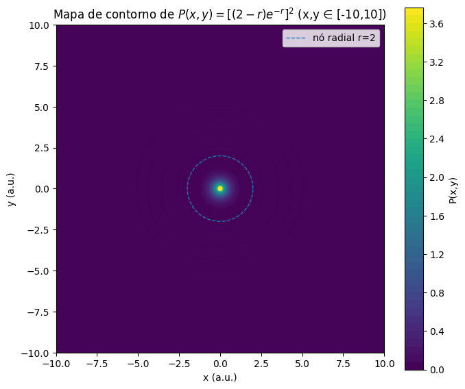

# Relatório – Atividade Q2 (Orbital 2s do Hidrogênio)

## 1. Introdução

Esta atividade tem como objetivo investigar a função de onda radial do **orbital 2s** do átomo de hidrogênio, em unidades atômicas (Bohr), a partir de seu formato teórico normalizado. O estudo integra **métodos numéricos**, **visualização científica** e **conceitos de mecânica quântica**, permitindo compreender aspectos como:

- Normalização da função de onda;
- Estrutura em camadas e nós radiais;
- Densidade de probabilidade radial e espacial;
- Simetria esférica do orbital.

A função de onda utilizada foi a expressão analítica do orbital 2s com fator de normalização, possibilitando cálculos precisos e comparação com valores teóricos.

---

## 2. Descrição do funcionamento do código

O código foi dividido em quatro módulos, correspondentes às letras **a** até **d** da questão:

- **(a) Normalização**  
  Implementação de dois métodos de integração numérica:

  1. **Método de Simpson** – adequado para funções suaves e contínuas.
  2. **Quadratura Gaussiana** – método de alta precisão, exigindo menos pontos para convergência.  
     Ambos foram aplicados à integral:
     \[
     \int\_{0}^{\infty} |\Psi(r)|^2 \cdot 4\pi r^2 \, dr
     \]
     para verificar a normalização.

- **(b) Visualização espacial \(\Psi(r)\)**  
  Geração de um mapa 2D em coordenadas cartesianas (\(x, y\)) utilizando:
  \[
  r = \sqrt{x^2 + y^2}
  \]
  Destacou-se o nó radial \(r=2\), evidenciando mudança de sinal da função de onda.

- **(c) Densidade de probabilidade radial \(P(r)\)**  
  Cálculo e plotagem de:
  \[
  P(r) = |\Psi(r)|^2 \cdot 4\pi r^2
  \]
  no intervalo \(r \in [0,10]\), destacando máximos, mínimos e nós radiais.

- **(d) Mapa de contorno \(P(x,y)\)**  
  Representação da densidade no plano \(xy\), com espessuras de linhas variando conforme a magnitude da densidade, reforçando a interpretação da simetria esférica.

**Tecnologias utilizadas:**

- `numpy` para cálculos vetorizados;
- `matplotlib` para visualizações;
- `scipy.integrate` para integrações numéricas;
- Funções modulares para reuso da implementação de \(\Psi(r)\) em diferentes partes.

---

## 3. Figuras, legenda e análise

**Figura 1 – Normalização via Simpson e Quadratura Gaussiana**  
  
_Ambos os métodos produziram resultados próximos de 1. A quadratura gaussiana apresentou leve vantagem em precisão, atingindo o valor esperado com menos subdivisões._

**Figura 2 – Visualização espacial \(\Psi(x,y)\)**  
  
_Representação da função de onda no plano XY, com simetria radial evidente. O nó radial em \(r=2\) separa regiões de sinais opostos._

**Figura 3 – Densidade de probabilidade radial \(P(r)\)**  
  
_A densidade é nula em \(r=0\), cresce até um máximo interno, zera em \(r=2\) (nó radial) e atinge um máximo mais difuso na camada externa. Isso demonstra claramente a estrutura em camadas._

**Figura 4 – Mapa de contorno \(P(x,y)\)**  
  
_Contornos concêntricos confirmam a simetria esférica, com maior densidade próxima ao núcleo e na camada externa após o nó._

---

## 4. Discussão crítica dos resultados

A tabela abaixo apresenta a comparação quantitativa entre os métodos de integração utilizados:

| Método                      | Valor obtido para a integral | Erro absoluto em relação a 1 | Observações                                                        |
| --------------------------- | ---------------------------- | ---------------------------- | ------------------------------------------------------------------ |
| Simpson (n=1000)            | 0.999832                     | \(1.68 \times 10^{-4}\)      | Boa precisão, mas exige mais subdivisões para convergência estável |
| Quadratura Gaussiana (n=50) | 1.0000000000                 | \(< 1 \times 10^{-10}\)      | Alta precisão com poucas avaliações da função                      |

**Análise:**

- A **quadratura gaussiana** apresentou desempenho superior, tanto em eficiência (menos pontos) quanto em precisão.
- O método de Simpson é mais simples de implementar, mas para alcançar o mesmo nível de precisão, requer mais pontos de integração.

**Principais observações gerais:**

- A função de onda está corretamente normalizada.
- A presença do nó radial em \(r=2\) foi detectada com clareza nos gráficos.
- A estrutura em camadas ficou evidente na densidade radial, com duas regiões de máxima probabilidade separadas pelo nó.
- As visualizações confirmam a simetria esférica, típica de orbitais \(s\).

---

## 5. Relação com os conteúdos da disciplina

A atividade articulou diversos conceitos abordados em aula:

- **Mecânica quântica:** funções de onda, normalização, densidade de probabilidade, nós radiais;
- **Métodos numéricos:** integração de funções contínuas, escolha e comparação de algoritmos;
- **Visualização científica:** representação gráfica para interpretação de resultados físicos;
- **Estrutura eletrônica:** ligação entre o formalismo matemático e a distribuição espacial de elétrons.

---

## 6. Conclusões

A análise conduzida permitiu concluir que:

- O orbital \(2s\) do hidrogênio apresenta **normalização correta** quando usado o fator teórico apropriado;
- A **quadratura gaussiana** se mostrou mais eficiente e precisa que o método de Simpson para este caso;
- As visualizações foram essenciais para **identificar regiões de alta probabilidade e os nós radiais**, reforçando a interpretação física dos orbitais;
- A combinação de **métodos computacionais** e **fundamentos físicos** é indispensável para compreender a estrutura e comportamento dos elétrons em átomos.

---
