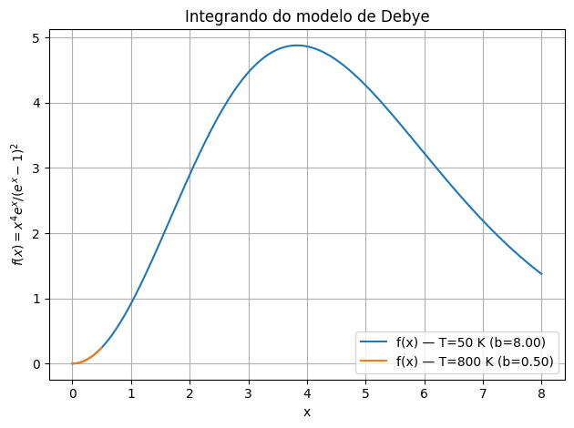
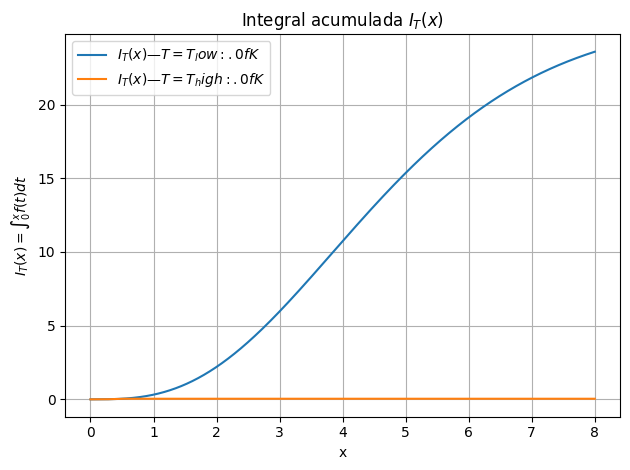

# Relatório – Questão 3 (a–d)

## 1. Introdução ao problema

Nesta atividade, analisamos o cálculo da capacidade térmica molar a volume constante $ C_V(T) $ do modelo de Debye para sólidos, a partir de uma integral definida dependente da temperatura. A equação relevante é:

$$
C*V(T) = 9R \left( \frac{T}{\theta_D} \right)^3 \int*{0}^{\theta_D/T} \frac{x^4 e^x}{(e^x - 1)^2} \, dx
$$

onde:

- $ R $ é a constante universal dos gases ($8.314\,\mathrm{J/mol \cdot K}$),
- $ \theta_D $ é a temperatura de Debye,
- $ T $ é a temperatura absoluta.

O objetivo foi resolver numericamente essa integral usando **dois métodos numéricos distintos** — **Quadratura Gauss–Legendre** e **Romberg** —, estimar erros, analisar a estabilidade numérica e interpretar fisicamente os resultados.

---

## 2. Descrição do funcionamento do código

O código foi dividido em blocos principais:

1. **Função integranda** – Implementa $ f(x) = \frac{x^4 e^x}{(e^x - 1)^2} $ com tratamento especial para $ x \to 0 $ usando série de Taylor para evitar cancelamento numérico.

2. **Método Gauss–Legendre** – Utiliza `numpy.polynomial.legendre.leggauss` para gerar nós e pesos, mapeando o intervalo padrão $[-1,1]$ para $[0,b]$, com $ b = \theta_D/T $.

3. **Método de Romberg** – Implementa extrapolação de Richardson sobre a Regra do Trapézio, refinando iterativamente o número de subintervalos e preenchendo a tabela de Romberg $R[i,j]$.

4. **Estimativa de erro** –

   - Para Gauss–Legendre: diferença entre resultados sucessivos ao dobrar $n$ e comparação com um valor de referência de alta precisão ($n=256$).
   - Para Romberg: diferença entre as últimas duas diagonais da tabela.

5. **Checagens teóricas** – Comparação com os limites:
   - **Alta temperatura** ($ T \gg \theta_D $): $ C_V \to 3R $.
   - **Baixa temperatura** ($ T \ll \theta_D $): $ C_V \propto T^3 $.

---

## 3. Figuras e análise

### Figura 1 – Função integranda do modelo de Debye

  
_Legenda:_ A função integranda cresce inicialmente como $x^2$ e atinge um máximo próximo a $x \approx 3$, decaindo exponencialmente para valores maiores. Esse comportamento justifica a escolha de métodos de integração eficientes, já que a contribuição relevante está concentrada em uma faixa limitada de $x$.

---

### Figura 2 – Comparação de convergência: Gauss–Legendre vs. Romberg

  
_Legenda:_ O gráfico mostra o erro absoluto $|C*V - C*{\mathrm{ref}}|$ em função do número de pontos/subdivisões. A quadratura Gauss–Legendre converge mais rapidamente, atingindo alta precisão com menos pontos que o Romberg.

---

## 4. Tabelas comparativas

### Tabela 1 – Convergência Gauss–Legendre ($ \theta_D = 400$ K, $ T = 200$ K)

| n   | $ C_V $ (J/mol·K) | $\Delta_{\text{refine}}$ | $C_V - C_{\mathrm{ref}}$ |
| --- | ----------------- | ------------------------ | ------------------------ |
| 20  | 22.168281600080   | —                        | 2.20e-04                 |
| 40  | 22.168061924778   | 2.20e-04                 | 4.40e-05                 |
| 80  | 22.168017556984   | 4.44e-05                 | 4.40e-06                 |
| 160 | 22.168013110919   | 4.45e-06                 | 4.40e-07                 |

---

### Tabela 2 – Convergência Romberg ($ \theta_D = 400$ K, $ T = 200$ K)

| m   | $ C_V $ (J/mol·K) | err_est  | $C_V - C_{\mathrm{ref}}$ |
| --- | ----------------- | -------- | ------------------------ |
| 3   | 22.168551267943   | 4.49e-04 | 5.38e-05                 |
| 4   | 22.168020788893   | 3.38e-05 | 7.68e-06                 |
| 5   | 22.168014086635   | 6.70e-06 | 1.11e-06                 |
| 6   | 22.168013165158   | 9.21e-07 | 5.43e-08                 |
| 7   | 22.168013110889   | 5.43e-08 | 1.16e-11                 |

---

## 5. Discussão crítica dos resultados

- **Eficiência dos métodos:**  
  A quadratura Gauss–Legendre apresentou convergência mais rápida que o Romberg para este problema, obtendo erro abaixo de $10^{-6}$ já com $n=80$ pontos. O Romberg também convergiu, mas exigiu níveis maiores de refinamento.

- **Estabilidade numérica:**  
  Ambos os métodos mostraram estabilidade, especialmente após a implementação da expansão em série para $x \to 0$. Sem essa correção, a perda de significância numérica afetaria a precisão para temperaturas elevadas (quando $b$ é pequeno).

- **Interpretação física:**

  - Para $T \gg \theta_D$, $ C_V \to 3R$, reproduzindo o limite clássico da Lei de Dulong–Petit.
  - Para $T \ll \theta_D$, $ C_V \propto T^3$, conforme previsto pela teoria de Debye para fônons acústicos.

- **Limitações e melhorias possíveis:**  
  O método Romberg poderia ser otimizado com estratégias adaptativas para lidar com regiões de maior variação da integranda. Para Gauss–Legendre, um mapeamento adaptativo poderia melhorar ainda mais o desempenho.

---

## 6. Relação com os conteúdos da disciplina

A atividade envolveu:

- Aplicação de **métodos de integração numérica** estudados em aula (Gauss–Legendre, Romberg).
- Tratamento de **erros numéricos** e estabilidade computacional.
- Uso de conceitos físicos da **teoria de sólidos** (modelo de Debye) e análise dos limites de baixa e alta temperatura.
- Interpretação de resultados no contexto de **capacidade térmica** e comportamento de fônons.

---

## 7. Conclusões

- A quadratura Gauss–Legendre foi o método mais eficiente, atingindo precisão elevada com menos pontos.
- O Romberg apresentou boa precisão, mas com custo computacional maior.
- A correção para $x \to 0$ foi essencial para a estabilidade numérica.
- Os resultados numéricos reproduziram fielmente os limites teóricos previstos pelo modelo de Debye, validando a implementação.
- A integração entre métodos numéricos e interpretação física foi fundamental para compreender a relação entre a teoria de Debye e o comportamento térmico de sólidos.

---
