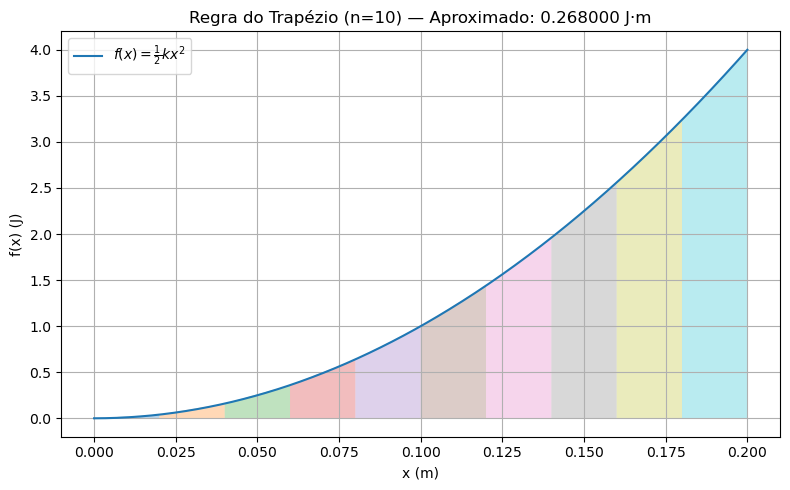
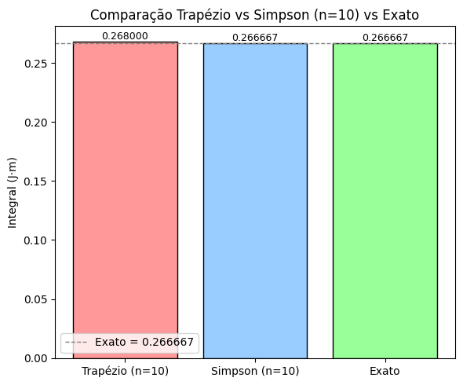
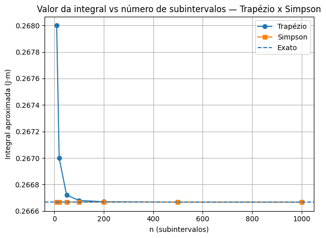
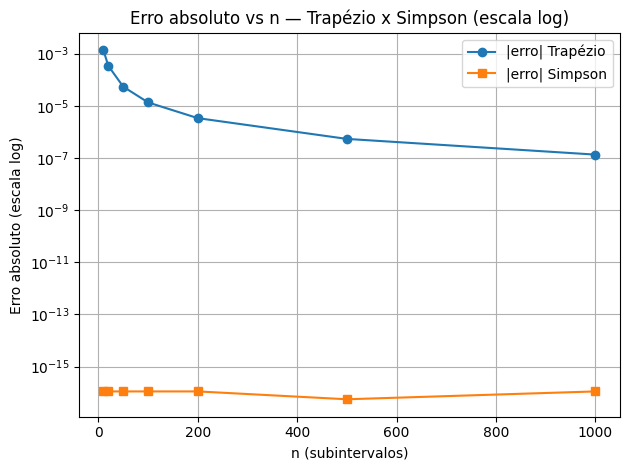

# Relatório

## 1. Introdução

Esta atividade teve como objetivo aplicar e comparar diferentes métodos numéricos de integração para calcular a **energia potencial elástica** armazenada em uma mola ideal, modelada pela função:

$$
U(x) = \frac{1}{2} k x^2
$$

com constante elástica $k = 200 \ \text{N/m}$ no intervalo $[0,\,0{,}2]$.  
A integral definida dessa função representa fisicamente o **trabalho necessário** para comprimir a mola até 0,2 m ou, de forma equivalente, a energia armazenada no sistema.

Foram abordadas as etapas das letras **(a)** até **(e)**, explorando:

- **Regra do Trapézio** (composta);
- **Regra de Simpson** (composta);
- **Aumento de resolução** para análise de convergência;
- **Método adaptativo de Simpson** com tolerância de erro especificada.

---

## 2. Descrição do funcionamento do código

O código foi implementado em **Python**, utilizando:

- `numpy` para operações numéricas vetorizadas;
- `matplotlib` para geração de gráficos;
- Implementações próprias para as regras de integração numérica.

### Etapas principais:

1. **Definição da função integranda**  
   Representa a energia potencial elástica em função da deformação $x$:
   ```python
   def f(x):
       return 0.5 * k * x**2
   ```
2. **Cálculo exato**: pela primitiva analítica:
   $$I_{\mathrm{exato}}=\dfrac{k}{6}(b^3 - a^3)$$.

3. **Regra do Trapézio**: implementação da forma composta, dividindo o intervalo em $n$ subintervalos igualmente espaçados.

4. **Regra de Simpson**: implementação da forma composta, com $n$ par.

5. **Aumento de resolução**: cálculo das integrais para diferentes valores de $n$ e análise da convergência.

6. **Método adaptativo de Simpson**: começa com $n=2$ e dobra $n$ até que o erro estimado por Richardson ($|I_{2n}-I_n|/15$) seja menor que a tolerância.

## 3. Figuras, legendas e análise



**Figura 1 — Aproximação pela Regra do Trapézio com $n=10$**
A figura mostra a função $U(x)$ sobreposta aos trapézios usados na aproximação. Nota-se que, devido à convexidade da parábola, o método do trapézio **superestima** levemente a área.

---



**Figura 2 — Comparação Trapézio x Simpson (n=10)**
Mostra valores obtidos pelos dois métodos e o valor exato. A Regra de Simpson **coincide com o valor exato** dentro da precisão numérica, pois o integrando é um polinômio quadrático. O Trapézio apresenta um pequeno erro positivo.

---



**Figura 3 — Valor da integral vs número de subintervalos**
Observa-se que o Trapézio converge gradualmente para o valor exato, enquanto Simpson mantém o resultado exato para qualquer $n$ par. Isso confirma a teoria de que Simpson é exato para polinômios de grau até 3.

---



**Figura 4 — Erro absoluto vs número de subintervalos (escala log)**
O erro do Trapézio decai quadraticamente ($O(h^2)$), enquanto o erro do Simpson está limitado pela precisão de máquina (~$10^{-15}$) desde $n=2$.

---

## 4. Discussão crítica dos resultados

- **Regra do Trapézio**: Apresentou convergência coerente com a teoria. É simples de implementar, mas exige mais subintervalos para atingir alta precisão.

- **Regra de Simpson**: Obteve o valor exato para qualquer $n$ par neste problema, graças à forma quadrática do integrando. Para funções polinomiais de baixo grau, essa eficiência é esperada.
- **Aumento de resolução**: Confirmou a ordem de convergência dos métodos e evidenciou que, para funções suaves, aumentar $n$ traz ganhos consistentes no Trapézio, mas irrelevantes no Simpson.

- **Método adaptativo**: Extremamente eficiente neste caso, encerrando em apenas **1 iteração**, pois a solução inicial já estava dentro da tolerância estabelecida.

- **Limitações**: para funções com descontinuidades, ruído ou forças não conservativas, a taxa de convergência pode ser reduzida e o erro estimado menos confiável.

---

## 5. Relação com os conteúdos da disciplina

A atividade consolidou conceitos vistos em aula, incluindo:

- **Integração numérica**: Trapézio e Simpson, suas fórmulas e ordens de erro.

- **Controle de erro adaptativo**: usando estimativas de Richardson.

- **Interpretação física**: relação da integral com energia potencial e trabalho.

- **Análise de convergência**: efeito do refinamento da malha sobre a precisão.

---

## 6. Conclusões fundamentadas em dados

- O valor da integral corresponde à **energia potencial elástica** armazenada na mola ou ao **trabalho realizado** para deformá-la.

- O método de Simpson foi o **mais preciso**, atingindo o valor exato com poucos subintervalos.

- O método adaptativo de Simpson mostrou-se **mais eficiente**, minimizando cálculos desnecessários.

- A escolha do método ideal depende da **natureza do integrando**:

  - Funções suaves → Simpson é excelente;

  - Funções irregulares → métodos adaptativos garantem controle de erro;

  - Funções descontínuas → requerem abordagens especiais.
